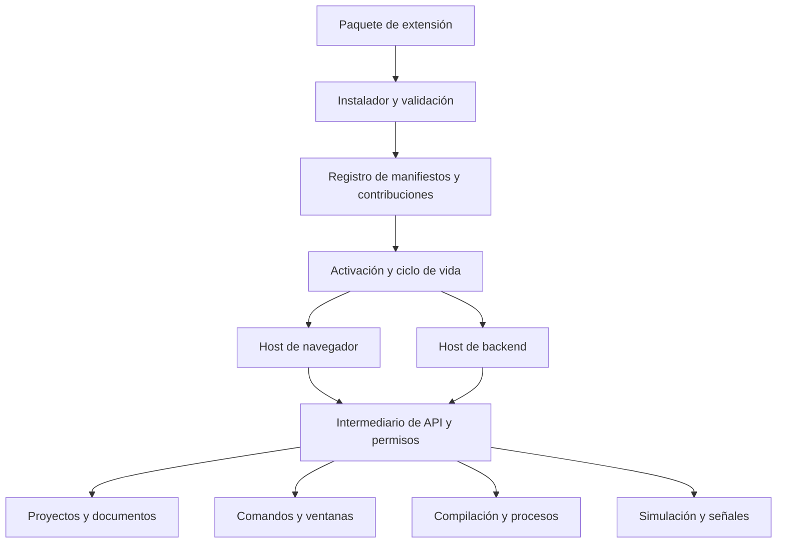
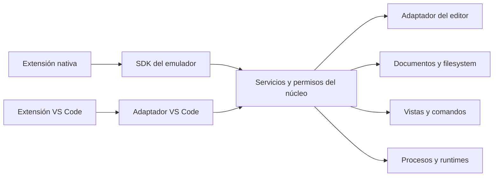

# Motor de extensiones del emulador

Estado: especificación propuesta; el motor descrito todavía no está implementado.
Fecha: 2026-10-04.
Primer caso de implementación: soporte ESPHome como extensión incluida de fábrica y posteriormente instalable.

## 1. Objetivo y decisiones de producto

Construir un sistema propio de extensiones inspirado en el modelo de VS Code: paquetes con manifiesto, contribuciones declarativas, API pública versionada, activación bajo demanda y ejecución separada del núcleo.

El criterio permanente es desarrollo custom y escalable. El núcleo conserva los contratos del producto; React, Dockview, herramientas de compilación y mecanismos de aislamiento quedan detrás de adaptadores. Una extensión no importa archivos internos del emulador ni accede a su estado global.

Decisiones adoptadas:

- Una extensión puede aportar comandos, ventanas, configuración, plantillas, hardware y proveedores especializados.
- Instalar, habilitar, activar y ejecutar una operación son acciones diferentes.
- Las ventanas de extensiones tienen el mismo comportamiento de agrupación, movimiento, cierre y persistencia por proyecto que las ventanas existentes.
- Los proyectos conservan sus datos cuando una extensión falta o está desactivada.
- ESPHome será el primer caso completo con frontend y backend; el núcleo mantiene MicroPython y las demás capacidades existentes durante la migración.
- La referencia a ESPHome significa una extensión de nuestro emulador. Integrarlo dentro de la extensión ESPHome de VS Code queda fuera de este documento.
- Esta dirección sustituye, para el alcance de extensibilidad, la intención histórica de retirar ESPHome mencionada en `SDD-EDITOR.md`. La optimización específica del editor MicroPython sigue siendo válida.

Se incorpora como objetivo la compatibilidad progresiva con extensiones reales de VS Code, además de las extensiones nativas del emulador. No se promete que todas o la mayoría funcionen antes de medirlo sobre un catálogo representativo. Importar un VSIX y ejecutar correctamente su código son capacidades distintas; la estrategia se desarrolla en las secciones 19–24.

## 2. Alcance y límites iniciales

El primer producto debe permitir descubrir paquetes, validar sus manifiestos, registrar contribuciones y administrar su habilitación por proyecto. Debe demostrar activación, limpieza, persistencia y recuperación con un paquete propio.

El registro público o marketplace llega después de estabilizar instalación local y compatibilidad. La instalación de extensiones de terceros con código ejecutable queda bloqueada hasta que exista y se pruebe el aislamiento correspondiente. El aislamiento de fallos de un proceso no equivale a aislamiento de seguridad.

Quedan fuera de la primera entrega:

- Compatibilidad general con la API de VS Code en la primera entrega; se evaluará por perfiles y versiones.
- Instalación automática al abrir un proyecto.
- Ejecución arbitraria de scripts de instalación.
- Acceso libre al disco, al DOM principal, a procesos o al socket Docker.
- Inicio automático de emuladores por abrir una ventana.
- Soporte universal de todas las placas y componentes ESPHome.

## 3. Bases existentes y cambios necesarios

| Área actual | Base reutilizable | Cambio requerido |
| --- | --- | --- |
| Catálogo e importador de módulos | Definiciones, SVG y validación | Registrar propiedad y procedencia de cada contribución |
| `Toolchain` | Preparación y compilación de firmware | Exponer un contrato público y adaptar proveedores |
| `MotorEmulacion` | Creación y control de backends | Registro administrado y host de ejecución |
| Acciones, menú y paleta | Comandos de UI | Registro con propietario, contexto y desregistro |
| Puente React | Separación entre componentes y efectos | Adaptador interno, sin exponer el puente como SDK |
| Distribución sobre Dockview | Modelo propio de grupos y divisiones | Ventanas dinámicas y migración del layout |
| Modelos eléctricos y chips | Contratos de comportamiento | Versionar proveedores y verificar aislamiento |
| Lenguajes del proyecto | Identificadores, extensiones y archivos iniciales | Separar identificadores persistidos de disponibilidad |

Hoy `WindowId` y `DOCK_WINDOWS` enumeran seis ventanas. Los registros `ENGINES` y `TOOLCHAINS` se construyen con imports del servidor. Los lenguajes y algunas reglas de archivos también son listas cerradas. Un sistema instalable requiere revisar todas estas fronteras; cambiar solo el menú o agregar un loader no alcanza.

La migración preservará los identificadores existentes y usará adaptadores para que los proveedores actuales sigan funcionando. No se reescribe toda la aplicación en una sola entrega.

## 4. Arquitectura



Responsabilidades separadas:

1. **Registro:** conoce paquetes, versiones, dependencias y contribuciones, sin ejecutar código para descubrirlas.
2. **Ciclo de vida:** activa cuando corresponde, coordina dependencias y limpia recursos.
3. **SDK:** contratos públicos que usa el autor de la extensión.
4. **Intermediario:** valida cada operación y aplica alcance, permisos y cuotas.
5. **Hosts:** ejecutan lógica fuera del hilo principal o proceso principal según su clase.
6. **Adaptadores del núcleo:** traducen la API pública a los servicios existentes.
7. **Gestor visual:** muestra instalación, habilitación, errores, permisos y actualizaciones.

La biblioteca utilizada por un adaptador no define el modelo persistido ni el protocolo público.

## 5. Formato del paquete

Estructura orientativa:

```text
extension.json
README.md
LICENSE
resources/
dist/browser.js
dist/backend.js
```

Los autores escriben TypeScript; los archivos JavaScript dentro del paquete son artefactos compilados, no fuentes editadas manualmente en este repositorio.

Ejemplo propuesto de manifiesto; los números de API son ilustrativos y no indican una versión publicada:

```json
{
  "manifestVersion": 1,
  "id": "cradel.esphome",
  "version": "1.0.0",
  "displayName": "ESPHome",
  "apiVersion": "^1.0.0",
  "entrypoints": {
    "browser": "dist/browser.js",
    "backend": "dist/backend.js"
  },
  "activationEvents": [
    "onLanguage:esphome",
    "onCommand:cradel.esphome.validate",
    "onBuildProvider:cradel.esphome.compiler"
  ],
  "permissions": [
    "documents.read",
    "build.run",
    "runtime.esphome"
  ],
  "contributes": {
    "commands": [
      {
        "id": "cradel.esphome.validate",
        "title": "ESPHome: validar configuración"
      }
    ],
    "languages": [
      {
        "id": "esphome",
        "extensions": [".yaml", ".yml"],
        "entryFile": "main.yaml"
      }
    ],
    "buildProviders": [
      {
        "id": "cradel.esphome.compiler",
        "language": "esphome"
      }
    ]
  }
}
```

Campos adicionales: autor, licencia, descripción, icono, dependencias con rangos de versión, capacidades necesarias, configuración y recursos.

Reglas:

- Identidad estable `publisher.name`; contribuciones con namespace del propietario.
- Versión de manifiesto, versión del paquete y compatibilidad de API son independientes.
- IDs duplicados se rechazan; una extensión no pisa contribuciones ajenas.
- Los IDs históricos como `esphome` se conservan mediante un alias autorizado del registro, sin permitir apropiación arbitraria por terceros.
- Los recursos solo pueden referenciar archivos dentro del paquete.
- Los puntos de extensión se validan con esquemas estrictos.
- Expresiones de contexto usan una gramática acotada, nunca `eval`.

## 6. Contribuciones y arbitraje

| Contribución | Contrato esperado |
| --- | --- |
| Comandos y menús | ID, título, contexto de disponibilidad, handler y cancelación |
| Ventanas | ID, título, renderer, ubicación inicial y política de restauración |
| Configuración | Esquema, valor inicial, alcance y migración |
| Hardware | Definición validada y dependencias de capacidades |
| Plantillas | Archivos iniciales y hardware requerido |
| Editor | Selectores de documentos y proveedores de diagnóstico, formato o completado |
| Instrumentación | Suscripciones filtradas y política de captura |
| Compilación | Entrada consistente, diagnósticos y artefactos normalizados |
| Emulación | Capacidades, ciclo de ejecución y transporte de señales |
| Apariencia | Tokens e iconos permitidos |

La elección de proveedor debe ser determinista. Para compilación, el proyecto referencia un proveedor o se resuelve un alias sin ambigüedad. Para operaciones como formato, el usuario puede elegir su proveedor. Los diagnósticos de varios proveedores conservan su procedencia y no se eliminan entre sí.

Cada registro devuelve un recurso descartable y queda asociado al propietario. Una contribución declarada pero todavía inactiva puede aparecer en la UI y activar su extensión al utilizarse.

## 7. API pública y protocolo

Servicios previstos del SDK:

- `commands`: registro y ejecución autorizada.
- `workspace`: proyectos, placas y contexto seleccionado.
- `documents`: lectura y modificaciones mediadas por el editor.
- `views`: árboles, formularios, tablas, instrumentos y vistas custom.
- `simulation`: lectura de señales y acciones autorizadas.
- `build`: validación, compilación, progreso, cancelación y artefactos.
- `configuration`: configuración efectiva por alcance.
- `storage`: estado privado global y por proyecto.
- `notifications`: mensajes al usuario.
- `runtimes`: solicitud de herramientas admitidas por el núcleo.

El SDK no expone `state`, `app.ts`, nodos DOM, instancias Dockview, mapas internos ni rutas absolutas del anfitrión.

Las operaciones entre hosts son asíncronas. El protocolo incluye versión, ID de solicitud, nombre de operación, parámetros validados, respuesta o error tipado y cancelación. Las suscripciones usan un identificador explícito y pueden terminar por desactivación, cambio de proyecto o caída del host.

La identidad de la extensión proviene de la conexión creada por el anfitrión. No se confía en un `pluginId` enviado como parámetro por el plugin. Las capacidades se ligan a propietario, proyecto y sesión; los canales tienen límites de tamaño y frecuencia.

Los contratos internos actuales se adaptan al protocolo: no se envían callbacks ni objetos no serializables directamente entre procesos.

### Documentos y cambios concurrentes

Un documento tiene identidad de proyecto, placa, ruta relativa y revisión. Leerlo debe distinguir contenido guardado y contenido abierto con cambios.

Las modificaciones se solicitan con revisión esperada y se aplican mediante transacciones del editor, conservando historial y diagnóstico. Si la revisión cambió, la API devuelve un conflicto; no sobrescribe silenciosamente.

Construir utiliza una instantánea identificada por revisión y contenido. Los resultados de una operación vieja no sustituyen los diagnósticos de una revisión nueva sin marcar su antigüedad.

## 8. Ejecución, confianza y permisos

| Clase | Estrategia |
| --- | --- |
| Declarativa | Datos interpretados por el núcleo después de validación |
| Código web incluido de fábrica | Host separado para contener fallos y trabajo pesado |
| Código web externo | Entorno aislado, restricciones de origen y recursos, y API mediada |
| Backend incluido de fábrica | Proceso supervisado y operaciones autorizadas |
| Backend externo | Aislamiento del sistema operativo o contenedor verificado antes de habilitarlo |

Un worker no tiene DOM, pero eso no impide por sí solo acceso a red. Un proceso separado puede seguir accediendo al disco o la red con permisos del usuario. `node:vm` tampoco constituye una frontera de seguridad para código no confiable.

Los permisos se verifican en el intermediario y nuevamente en el servidor cuando corresponde:

| Permiso | Alcance |
| --- | --- |
| `documents.read` | Documentos de un proyecto autorizado |
| `documents.write` | Cambios mediante el servicio de documentos |
| `simulation.read` | Señales de una ejecución autorizada |
| `simulation.control` | Entradas permitidas de esa ejecución |
| `build.run` | Solicitar una tarea administrada |
| `network.connect` | Destinos declarados y autorizados |
| `runtime.esphome` | Perfil de ejecución ESPHome definido por el núcleo |
| `process.run` | Perfiles de herramientas aprobados, no shell libre |

Una actualización que amplía permisos necesita una autorización nueva. La instalación no concede acceso a todos los proyectos. Firmar un paquete verifica procedencia e integridad, no garantiza su comportamiento.

El visor compartido por LAN tiene capacidades reducidas. No carga extensiones del editor ni permite instalar paquetes, leer fuentes o iniciar tareas de compilación.

## 9. Ventanas propias y vistas custom

Se ofrecen dos mecanismos:

1. **UI declarativa:** el plugin aporta datos y acciones; componentes React del núcleo presentan árboles, formularios, tablas y gráficos con el tema y accesibilidad propios.
2. **Vista custom:** contenido del plugin en un iframe aislado con intercambio de mensajes, políticas de recursos y capacidades acotadas.

Los plugins externos no montan React libremente en el DOM principal. Los componentes internos pueden reutilizarse mediante adaptadores de confianza sin convertir esa posibilidad en una API pública.

La configuración de aislamiento de iframes debe verificarse antes de habilitar contenido externo. No se combina acceso al origen del editor con ejecución de scripts del plugin. Los mensajes se validan por canal, emisor y esquema; no se acepta cualquier `postMessage` global.

Una vista recibe eventos de apertura, visibilidad, tamaño y cierre. Puede suspender procesamiento mientras está oculta y guardar el estado necesario para restaurarse.

## 10. Distribución y persistencia por proyecto

Separar el árbol de distribución guardado del catálogo de ventanas disponibles.

- Las ventanas incorporadas conservan IDs actuales.
- Las ventanas nuevas usan IDs con namespace.
- El layout persiste posición, grupo, tamaño, estado abierto y pestaña activa.
- Si falta una extensión, se conserva su lugar con un marcador explicativo.
- Reinstalarla recupera esa posición.
- Desinstalar no destruye silenciosamente la distribución ni archivos del proyecto.
- Un proyecto nuevo recibe la distribución predeterminada del usuario.
- Agregar una contribución no reorganiza automáticamente proyectos existentes.

La migración desde el layout actual debe validar estructura y límites por separado de la disponibilidad de IDs. No debe exigir que todas las extensiones estén activas para aceptar un archivo de distribución.

| Estado persistido | Alcance |
| --- | --- |
| Paquetes y versiones instaladas | Anfitrión |
| Habilitación y permisos | Usuario, extensión y proyecto |
| Configuración | Global o proyecto, según esquema |
| Layout | Proyecto |
| Estado de herramienta | Extensión y proyecto |
| Captura temporal | Ejecución |
| Secretos | Almacenamiento específico, fuera de configuración exportable |

Un proyecto puede recomendar extensiones y fijar versiones para reproducibilidad. Al abrirlo, se informa de dependencias faltantes; no se ejecuta instalación automática.

## 11. Ciclo de vida y recuperación

Estados previstos: descubierta, instalada, deshabilitada, habilitada, activando, activa, desactivando, incompatible y fallida.

Activación bajo demanda por comando, vista, lenguaje, proveedor o capacidad requerida. Las dependencias se resuelven antes de activar; se rechazan ciclos y versiones incompatibles.

Toda activación tiene plazo máximo, operación de cancelación e identidad de contexto. La operación debe ser idempotente frente a pedidos concurrentes.

Al desactivar o perder el host:

- Cancelar solicitudes y tareas pendientes.
- Retirar handlers, proveedores y suscripciones.
- Liberar recursos y detener procesos asociados.
- Conservar configuración, estado persistente y lugares de ventanas.
- Mostrar un error atribuible a la extensión sin bloquear el editor.

`deactivate` permite limpieza cooperativa, pero el núcleo debe limpiar aunque esa función no se ejecute o falle. Una caída no se reinicia en bucle indefinido; se aplica un límite y se ofrece recuperación o deshabilitación.

## 12. Rendimiento y protección de recursos

La estabilidad del equipo es un requisito, especialmente por el bloqueo previo informado por el usuario.

- Activación diferida; ningún emulador se inicia por abrir una ventana.
- Una operación pendiente por canal cuando el servicio no admite concurrencia.
- Cola de compilación con límite configurable y valores iniciales conservadores.
- Separar simultaneidad de compilación de simultaneidad de simulación: varias placas pueden probarse juntas sin iniciar compilaciones ilimitadas.
- Suscripciones filtradas por proyecto, placa y señal.
- Agrupación de eventos de presentación y buffers acotados.
- Captura precisa mediante un servicio especializado; no usar eventos visuales descartables como historial exacto.
- Reducir actividad en vistas ocultas.
- Límites de mensajes, tareas, tamaños, tiempo y volumen de registros.
- Medir duración de activación, errores, colas y tráfico por extensión.

Los workers del navegador no garantizan cuotas duras de memoria. Los límites de backend dependen del aislamiento elegido y deben verificarse. No se describirán como garantías controles que solo son observaciones o mecanismos cooperativos.

## 13. Instalación, actualización y desinstalación

Empezar con archivo local y catálogo de paquetes conocidos. Preparar la instalación en una carpeta temporal y publicar la versión completa de forma atómica.

Validar formato, compatibilidad, dependencias, rutas, enlaces simbólicos, tamaño comprimido y expandido, integridad y recursos. Rechazar traversal y archivos fuera de la carpeta del paquete. No ejecutar scripts de instalación.

Las versiones se almacenan separadas para permitir rollback. La activación de la nueva versión ocurre después de validar y migrar estado con copia recuperable. No cambiar el proveedor usado por una compilación en curso; su ejecución conserva la versión con la que comenzó.

Desinstalar ofrece conservar o eliminar estado privado, sin borrar archivos del proyecto. Si hay operaciones activas, primero se cancelan o se completa su cierre de manera explícita.

El modo de desarrollo usa una carpeta local habilitada expresamente, recarga solo la extensión y muestra su procedencia. No descubre ni ejecuta código arbitrario de las carpetas de proyectos.

## 14. ESPHome como primera extensión completa

### 14.1 Responsabilidades

| Núcleo | Extensión ESPHome |
| --- | --- |
| Documentos e instantáneas | Interpretación de configuración ESPHome |
| Proyectos y placas | Validación de compatibilidad con ESPHome |
| Cola y supervisión | Solicitud de validación y compilación |
| Runtime autorizado | Selección de versión compatible dentro de perfiles admitidos |
| Artefactos normalizados | Identificación del firmware y ELF |
| Motor eléctrico y emulador | Adaptación al puente de simulación |
| Ventanas y configuración | Herramientas y opciones específicas |

La extensión consta de frontend, backend y recursos. Activarla registra proveedores; no inicia Docker ni descarga dependencias automáticamente.

### 14.2 Migración del toolchain existente

El toolchain actual ya genera YAML de simulación, inyecta el puente, compila en Docker, traduce errores y entrega artefactos. Inicialmente será un proveedor incorporado detrás del contrato nuevo.

La versión de imagen actualmente fijada en el código es `ghcr.io/esphome/esphome:2026.9.0`; esto describe el repositorio, no una recomendación de actualizar ni una afirmación de que sea la última versión.

Después se trasladan al paquete el proveedor, las plantillas y los recursos específicos. El paquete deja de importar `PATHS`, `BuildService`, `dockerRunner` y otros archivos internos; solicita servicios públicos equivalentes.

Los identificadores persistidos `esphome` se mantienen. La disponibilidad del lenguaje y del proveedor se resuelve mediante el registro. Las reglas globales de archivos y listas cerradas se migran conservando la lectura de proyectos antiguos.

### 14.3 Archivos y configuración completa

La compilación actual parte de `main.yaml` y copia `secrets.yaml`. La extensión completa debe preparar una instantánea por placa con carpetas, YAML incluidos, paquetes locales, recursos y archivos C/C++ referenciados.

Resolver `!include`, `!secret` y paquetes con semántica ESPHome; no mediante reemplazos globales de texto o expresiones regulares. Validar rutas y declarar las necesidades de descarga de dependencias externas.

Los recursos descargados tendrán procedencia y referencia de versión o commit registrados. Los secretos no se incluyen en logs, vistas compartidas, manifiestos exportables ni diagnósticos sin filtrado.

Los diagnósticos apuntan a archivo y línea originales. Los mapas deben abarcar múltiples archivos y transformaciones, no únicamente `main.yaml`.

### 14.4 Destinos distintos

- **Simulación:** generar archivos derivados con adaptaciones y puente compatible.
- **Dispositivo físico:** utilizar configuración original sin inyectar componentes de simulación.

Los originales no se modifican al construir. El puente es un recurso versionado compatible con la API de firmware del emulador. El mecanismo `external_components` de ESPHome permite distribuir componentes locales o externos, pero su uso requiere controlar versiones y permisos de construcción.

### 14.5 Contrato de construcción

Entrada: instantánea de documentos de una placa, descriptor de capacidades, destino, configuración, versión de extensión y cancelación.

Salida: resultado, diagnósticos con ruta/rango/severidad, advertencias, información de procedencia y referencias administradas a firmware, ELF y metadatos.

No suponer que el nombre del dispositivo en YAML coincide con el proyecto ni fijar rutas de artefactos únicamente a partir del nombre del proyecto.

La extensión solicita un perfil de ejecución ESPHome al núcleo. No recibe acceso al socket Docker, shell libre ni montajes de carpetas arbitrarias. El núcleo limita montajes, procesos, tiempo y recursos.

### 14.6 Compatibilidad y ausencia

Distinguir configuración válida, firmware compilable y funcionalidad simulable. Consultar arquitectura, motor, modo de IO, pines reservados y periféricos disponibles. Informar de capacidades faltantes antes de una compilación costosa cuando sea posible.

Si ESPHome está ausente o deshabilitado, los archivos siguen siendo accesibles, el circuito conserva su distribución y la compilación muestra qué proveedor falta. No se eliminan proyectos ni se activa otra extensión silenciosamente.

## 15. Organización propuesta del código

Ubicaciones orientativas, sujetas a las convenciones del monorepo:

```text
app/shared/src/extensions/       contratos y esquemas serializables
app/server/src/extensions/       instalación, registro, permisos y host backend
app/web/extensions/              adaptador web, canales y registro de vistas
app/web/react/extensions/        interfaz del gestor y componentes declarativos
extensions/esphome/             paquete incorporado ESPHome
app/tests/unit/                 lógica pura y migraciones
app/tests/e2e/                  comportamiento del editor y gestor
```

Un paquete SDK independiente para autores se publica después de estabilizar el contrato. Las bibliotecas se seleccionan por responsabilidad —validación, versiones, transporte, archivos— y se encapsulan. No se adopta una plataforma completa que reemplace el modelo del emulador sin evaluar su coste de migración.

## 16. Plan por etapas y criterios de salida

| Etapa | Entrega | Criterio de salida |
| --- | --- | --- |
| 0 | Caracterización | Tests de comandos, layout, build y proyectos existentes antes de refactorizar |
| 1 | Registros propios | Comandos y ventanas incorporadas usan propietario y desregistro; proyectos antiguos siguen funcionando |
| 2 | Manifiestos declarativos | Instalación local atómica, compatibilidad y dependencias sin ejecutar código externo |
| 3 | SDK y ciclo de vida | Activación, cancelación, mensajes y limpieza demostrados con extensión de confianza |
| 4 | Ventanas dinámicas | Mover, cerrar, recuperar y restaurar ventanas ausentes sin perder layout |
| 5 | Instrumento de prueba | Analizador lógico independiente valida señales, buffers y visibilidad |
| 6 | ESPHome incorporado | Toolchain actual detrás de API, luego paquete con frontend y backend; build cancelable y proyectos multifichero |
| 7 | Extensiones externas | Aislamiento y permisos verificados antes de habilitar código de terceros |
| 8 | Distribución | Actualización, rollback, diagnóstico y catálogo público sobre contratos estables |

Cada etapa produce un resultado utilizable y se prueba con un solo trabajador cuando sea suficiente. No se acumulan procesos de desarrollo, emuladores o compilaciones durante la validación.

## 17. Validación y aceptación

Pruebas necesarias:

- Manifiesto inválido, contribución duplicada, dependencias circulares y API incompatible.
- Activación concurrente, timeout, fallo parcial y limpieza sin `deactivate`.
- Permiso denegado y revocado; intento de acceso a otro proyecto o placa.
- Mensajes falsificados, payload excesivo y suscripción sin cancelar.
- Edición concurrente y diagnóstico de una revisión anterior.
- Layout antiguo, plugin ausente, desinstalación y posterior recuperación de posición.
- Instalación corrupta, traversal, actualización fallida y rollback.
- Cambiar de proyecto durante una operación.
- Vista compartida sin acceso a capacidades del editor.
- Compilación ESPHome con archivos incluidos, secretos, nombre de dispositivo diferente y error en archivo secundario.
- Cancelación efectiva de procesos y ausencia de trabajos después de desactivar.
- Conservación de proyectos MicroPython y restantes toolchains.

Playwright verificará gestor, menús, ventanas, persistencia y permisos visibles. Los contratos y migraciones usarán tests unitarios; instalación y autorización tendrán tests de servidor. Las compilaciones reales ESPHome se ejecutarán de manera acotada en un entorno preparado, separadas de las pruebas rápidas con runtimes simulados.

Aceptación final del caso ESPHome: instalar el paquete sin agregar imports al núcleo, abrir un proyecto existente, validar y compilar varios archivos, ejecutar mediante el motor existente, cancelar trabajo, desactivar sin perder datos y reinstalar conservando configuración y distribución.

## 18. Decisiones pendientes antes de ejecutar etapas posteriores

- Mecanismo concreto de aislamiento y perfiles del sistema operativo para código externo.
- Transporte RPC y estrategia de backpressure.
- Límites iniciales de tareas, buffers y procesos, medidos en el equipo objetivo.
- Política de proveedores alternativos y resolución de dependencias entre proyectos.
- Formato definitivo de archivo distribuible y verificación de editor/publicador.
- Reglas de exportación de proyectos y recursos privados.

Estas decisiones no bloquean los registros, los manifiestos declarativos ni la adaptación de ESPHome de fábrica. Sí bloquean habilitar ejecución de terceros cuando afecten su seguridad o compatibilidad.

## 19. Cobertura de familias de extensiones

El sistema no debe limitarse a ESPHome ni a herramientas electrónicas. La siguiente matriz define familias a contemplar; expresa requisitos de diseño, no compatibilidad implementada.

| Familia | Ejemplos | Servicios necesarios y límites |
| --- | --- | --- |
| Formato | Prettier, formateadores Python | Documentos, configuración, selección de proveedor y transacciones |
| Diagnóstico y corrección | ESLint, analizadores Python | Diagnósticos por revisión, acciones de código, dependencias y runtime |
| Lenguajes | YAML, C/C++, Python, JSON | Completado, hover, navegación, símbolos, tokens y eventualmente LSP |
| Edición | Snippets, comentarios, navegación | Selecciones, rangos, comandos, contexto y undo/redo |
| Temas e iconos | Colores, iconos de archivos | Traducción de tokens y recursos a la UI propia |
| Exploradores y vistas | Árboles, paneles de dispositivos | Proveedores de árbol, acciones contextuales y ventanas persistentes |
| Control de versiones | Git, herramientas de historial | Repositorios reales, SCM, procesos y credenciales autorizadas |
| Depuración | Adaptadores de lenguajes o firmware | Sesiones, breakpoints, transportes y eventualmente DAP |
| Pruebas | Test runners | Descubrimiento, ejecución, cancelación y resultados |
| Tareas y terminales | Build tools, consolas | Procesos, pseudo-terminal cuando corresponda y directorio autorizado |
| Documentos custom | Previsualizadores, notebooks | Modelos de documentos, renderers y almacenamiento específico |
| Servicios externos | IA, colaboración, servicios cloud | Red, secretos, autenticación y permisos explícitos |
| Entornos remotos | Contenedores y runtimes externos | Infraestructura de conexión y filesystem; compatibilidad posterior |
| Electrónica | Placas, sensores, instrumentos | Contratos propios de hardware y simulación |

No asumir que Prettier cubre todos los lenguajes del emulador. El registro de formatos selecciona proveedores según sus capacidades; Python, C/C++ y YAML pueden usar herramientas diferentes. Compartir extensión de archivo tampoco garantiza compartir semántica: un documento ESPHome puede requerir herramientas específicas además del soporte YAML general.

LSP permite reutilizar servidores de lenguaje sin ejecutar necesariamente su extensión VS Code. DAP cumple un papel análogo para depuradores. La integración de un servidor o herramienta no equivale a compatibilidad con el paquete completo que la distribuye.

## 20. Dos APIs sobre los mismos servicios de dominio

La arquitectura admitirá dos accesos:

- **SDK nativo del emulador:** hardware, simulación, compilación y herramientas custom.
- **Adaptador de compatibilidad VS Code:** interpreta su manifiesto, ejecuta su entrypoint cuando el host lo permite y proporciona un subconjunto explícito de `vscode`.

Ambos llegan al mismo sistema de documentos, comandos, configuración y vistas. No se mantienen dos estados de proyecto, dos historiales ni dos árboles de archivos independientes.



### 20.1 Importación de VSIX

El instalador reconoce `package.json`, recursos y entrypoints de un paquete VSIX, valida rutas y extrae una descripción normalizada con procedencia preservada. No modifica los archivos del autor para fingir que son un plugin nativo.

Analizar `engines.vscode`, `main`, `browser`, contribuciones, dependencias, packs, eventos de activación y capacidades declaradas. No agregar un `extension.json` al paquete como condición para importar una extensión VS Code.

El descriptor interno debe conservar el formato de origen y señalar cómo se eligió el host. Una dependencia ausente o no compatible impide activar las funciones que la requieren; instalar un pack no demuestra que sus integrantes funcionen.

### 20.2 Perfiles de compatibilidad

| Perfil | Alcance inicial esperado |
| --- | --- |
| Declarativo | Snippets, configuración, metadatos de lenguajes e iconos; temas y gramáticas necesitan traducción o servicios adicionales |
| Web | Extensiones con entrypoint web y APIs efectivamente soportadas |
| Backend Node | Extensiones que necesitan módulos Node, filesystem o herramientas locales, dentro del entorno aprobado |
| Plataforma avanzada | SCM, terminales, depuración, notebooks, autenticación y otros servicios completos |
| Especial o no disponible | APIs propuestas, funciones propietarias o dependencia de infraestructura ausente |

Los perfiles no son niveles que garanticen todas las funciones de una extensión. Se publican una versión de API soportada y una matriz de capacidades implementadas, parciales y ausentes.

Un método no implementado no debe devolver un éxito vacío. El catálogo distingue: sin evaluar, compatible verificada, compatible con límites, incompatible y bloqueada por permisos. Los fallos de activación explican la API o dependencia faltante.

### 20.3 Superficie mínima del adaptador

La primera prueba de compatibilidad debe cubrir como mínimo las APIs que realmente utilicen sus extensiones objetivo:

- `Uri`, `Position`, `Range`, selecciones, ediciones y cancelación.
- `TextDocument`, `TextEditor` y eventos de apertura, cambio y guardado.
- Comandos y registro de proveedores de formato.
- Configuración, carpetas de workspace y lectura de archivos.
- Diagnósticos, canales de salida y mensajes básicos.
- Contexto de extensión, almacenamiento, recursos descartables y activación.

Después se agregan árbol de vistas, acciones de código, semántica avanzada de lenguajes, webviews y proveedores de procesos según la evidencia de los paquetes probados.

El SDK propio es asíncrono entre hosts, pero VS Code tiene también consultas síncronas. El adaptador necesitará una réplica coherente de documentos y metadatos para esas consultas, con orden de eventos y revisiones verificados. No se puede convertir toda la API a Promises sin romper extensiones existentes.

### 20.4 Filesystem y editor

Definir una identidad de documento que preserve proyecto, placa y ruta, por ejemplo un URI virtual `emu://workspace/<proyecto>/<placa>/<ruta>`. El esquema definitivo requiere especificar codificación, autoridad, reglas de normalización y aislamiento.

Un filesystem virtual funciona para extensiones que usan los servicios públicos de archivos. Las que llaman directamente a Node `fs`, usan `uri.fsPath` o buscan dependencias con herramientas locales pueden requerir un workspace materializado en el backend. VS Code documenta esta diferencia para workspaces virtuales. [Referencia](https://code.visualstudio.com/api/extension-guides/virtual-workspaces).

La materialización debe definir cómo se sincronizan documentos abiertos, archivos guardados, watchers, operaciones externas y conflictos. Un archivo temporal de compilación no sustituye un workspace coherente para una extensión de lenguaje.

Verificar posiciones UTF-16, Unicode, fin de línea CRLF/LF, cambios múltiples, selecciones, rangos, undo/redo y eventos de guardado. Estas reglas afectan tanto CodeMirror como cualquier adaptador futuro.

Mantener CodeMirror permite compatibilidad parcial mediante traducciones propias, pero no proporciona automáticamente la API de VS Code. Adoptar Monaco con servicios adicionales tampoco debe duplicar la fuente de verdad de documentos: primero se define el contrato del editor y después se evalúa una migración.

### 20.5 Compatibilidad y seguridad no son equivalentes

Una extensión Node puede acceder directamente a `fs`, red y procesos sin pasar por nuestro SDK. Los permisos aplicados al adaptador `vscode` no controlan por sí solos esas llamadas.

Para código externo, el host Node requiere aislamiento real: workspace permitido, runtime controlado, acceso de red restringido, límites y supervisión de procesos descendientes. Restringir esas capacidades puede volver incompatibles funciones de una extensión; la UI debe mostrarlo.

Si se ofrece un modo de confianza más amplio para paquetes seleccionados, debe ser explícito y distinto del modo restringido. No anunciar que una extensión tiene permisos granulares garantizados si sus dependencias pueden evadirlos.

## 21. Prettier como caso de compatibilidad

Se plantean dos entregas diferentes:

1. **Prettier nativo:** usar su motor mediante nuestro proveedor de formato.
2. **Extensión Prettier de VS Code:** instalar una versión concreta del paquete y verificar su comportamiento en el host compatible.

La primera permite entregar utilidad pronto. La segunda demuestra compatibilidad real; reutilizar el motor de Prettier no prueba que su extensión VS Code funcione.

### 21.1 Proveedor nativo

Prettier tiene una distribución para navegador que formatea sin Node. No resuelve automáticamente archivos de configuración, ignores o plugins; esos servicios deben implementarse alrededor o ejecutarse mediante otro runtime. [Documentación oficial](https://prettier.io/docs/browser).

El proveedor debe:

- Seleccionar parser según documento y capacidades verificadas.
- Cargar solo parsers necesarios, fijados y empaquetados; no descargar código arbitrario al formatear.
- Resolver configuración y exclusiones de forma explícita.
- Devolver ediciones que se apliquen a la revisión correcta.
- Integrarse en formatear documento y, si el proveedor lo soporta, selección o rango.
- Participar en la política de formato al guardar sin producir un bucle de guardado.
- Respetar proveedor predeterminado por lenguaje y proyecto.

La configuración inicial admitirá formatos declarativos. Configuración JavaScript y plugins de Prettier contienen código ejecutable y pasan por la misma política de confianza que otros plugins; leerlos como archivos no autoriza ejecutarlos.

### 21.2 Paquete VS Code original

La extensión de Prettier puede buscar Prettier y plugins instalados en el workspace. Por eso se evaluarán resolución de módulos, filesystem, configuración y restricciones del host, además del registro de formato. [Repositorio del proyecto](https://github.com/prettier/prettier-vscode).

Fijar la versión del VSIX y del motor utilizado en cada prueba. Registrar si funciona con el motor incluido, con una dependencia del proyecto o con plugins adicionales. No copiar `node_modules` o ejecutar instalación automática al abrir un proyecto.

La aceptación exige instalar el paquete original sin modificar su código, activar por el evento esperado, ejecutar su proveedor sobre un documento abierto y comprobar el resultado, configuración, historial y cancelación. Una adaptación del código fuente se identifica como port nativo, no como compatibilidad sin modificaciones.

## 22. Reutilización de plataformas existentes

Para un objetivo amplio de compatibilidad, no conviene reconstruir toda la plataforma VS Code a mano. Se requiere una prueba comparativa antes de elegir dependencias o sustituir el editor.

| Alternativa | Encaje y coste a evaluar |
| --- | --- |
| Adaptador propio sobre CodeMirror | Conserva la interfaz actual; ofrece un alcance controlado, con coste de mantener cada API traducida |
| Monaco y `monaco-vscode-api` | Reutiliza servicios de VS Code sobre Monaco; requiere evaluar adaptación o migración del editor, paquetes y hosts disponibles |
| Plataforma Eclipse Theia | Ofrece infraestructura de extensiones VS Code; implica una decisión de arquitectura de producto mucho más amplia |

`monaco-vscode-api` aporta servicios y soporte de extensiones para Monaco; su documentación describe un host web en worker y servicios de archivos. Esto no demuestra compatibilidad de todos los paquetes Node ni integración directa con CodeMirror. [Repositorio oficial](https://github.com/CodinGame/monaco-vscode-api).

Theia documenta soporte de extensiones VS Code con una versión de API y un registro de capacidades; también señala APIs parciales o stubbed. Es evidencia de que reutilizar una plataforma existente puede ampliar el alcance, no una garantía para nuestro producto. [Documentación oficial](https://theia-ide.org/docs/user_install_vscode_extensions/).

Decisión provisional:

- Mantener los contratos propios del dominio y los avances del editor actual.
- Implementar herramientas útiles con SDK nativo y protocolos estándar cuando sea conveniente.
- Hacer una prueba aislada de compatibilidad real, sin migrar producción primero.
- Si la prioridad pasa a ser una cobertura amplia del ecosistema, elegir infraestructura reutilizable a partir de resultados, en lugar de aumentar indefinidamente un shim incompleto.

La filosofía custom se aplica a los contratos y al producto. No obliga a reimplementar tecnologías existentes que podemos encapsular.

### 22.1 Distribución de extensiones externas

Contemplar archivo VSIX local, catálogo propio y Open VSX como fuentes posibles. Theia utiliza Open VSX para distribuir extensiones compatibles. [Referencia](https://theia-ide.org/docs/extensions/).

Antes de habilitar una fuente, verificar sus condiciones de uso y las licencias de cada paquete. No asumir que podemos utilizar o redistribuir todo el Marketplace de Microsoft por implementar la API.

Guardar origen, versión, integridad y procedencia de cada paquete. La búsqueda del catálogo filtra por host y capacidades disponibles, y no oculta limitaciones conocidas.

## 23. Medir el objetivo de «la mayoría»

No usar la cantidad de métodos implementados ni la instalación exitosa como porcentaje de compatibilidad.

Definir un catálogo objetivo representativo y versionado con, al menos:

- Prettier original y un caso de formato nativo.
- Un proveedor de diagnóstico.
- Una extensión de lenguaje con servidor externo.
- Un paquete de snippets, un tema y un paquete de iconos.
- Una extensión con vista de árbol y otra con webview.
- Un caso SCM, uno de pruebas y uno de depuración.
- ESPHome nativo para asegurar que las capacidades del emulador no dependan de la compatibilidad VS Code.

Cada paquete tiene una ficha: ID, versión, host, permisos, dependencias, funcionalidades probadas, fallos, tiempo de activación y coste de recursos.

Los resultados distinguen funciones esenciales completas, compatibilidad parcial e incompatibilidad. Declarar «mayoría» solo sobre un conjunto identificado y después de verificar sus flujos esenciales; no extrapolarlo a todo el marketplace.

Casos de aceptación de formato:

- Configuración global y por proyecto.
- Documento sin guardar y modificación concurrente.
- UTF-16, Unicode y CRLF.
- Rango, documento completo, undo/redo y proveedor seleccionado.
- Formato al guardar sin bucles ni doble aplicación.
- Cancelación y error sin pérdida de texto.

También medir bundle, arranque, memoria, latencia de escritura, workers y procesos. Mantener una vía de deshabilitación o rollback si la infraestructura afecta la estabilidad del equipo.

## 24. Secuencia complementaria de implementación

La ampliación no habilita ejecución de terceros antes de la etapa de aislamiento. Agrega estas entregas al plan de la sección 16:

1. Ampliar el servicio de documentos y proveedores de formato sin cambiar el editor.
2. Entregar Prettier nativo para documentos soportados, con versión fijada y configuración declarativa.
3. Definir el catálogo objetivo y la matriz de API VS Code requerida.
4. Probar importación declarativa de VSIX y preservar su manifiesto original.
5. Comparar adaptador propio e infraestructura reutilizable en una prueba aislada, incluyendo Prettier original y una extensión de lenguaje.
6. Elegir host, editor y filesystem a partir de pruebas de compatibilidad y rendimiento.
7. Habilitar paquetes externos solo con aislamiento probado y resultados visibles por versión.
8. Ampliar SCM, terminales, DAP, notebooks y servicios avanzados según la demanda y las dependencias comprobadas.

ESPHome y Prettier cumplen papeles diferentes: ESPHome comprueba extensión del dominio y backend de compilación; Prettier comprueba documentos, formato y, mediante el paquete original, compatibilidad VS Code. Ninguno sustituye las pruebas del otro.

## 25. Referencias

- [Arquitectura de una extensión VS Code](https://code.visualstudio.com/api/get-started/extension-anatomy)
- [Capacidades de extensiones VS Code](https://code.visualstudio.com/api/extension-capabilities/overview)
- [Manifiesto VS Code](https://code.visualstudio.com/api/references/extension-manifest)
- [Host de extensiones](https://code.visualstudio.com/api/advanced-topics/extension-host)
- [Extensiones web](https://code.visualstudio.com/api/extension-guides/web-extensions)
- [Webviews](https://code.visualstudio.com/api/extension-guides/webview)
- [Limitaciones de seguridad de node:vm](https://nodejs.org/api/vm.html)
- [CLI ESPHome](https://esphome.io/guides/cli/)
- [Componentes externos ESPHome](https://esphome.io/components/external_components/)
- [Arquitectura actual del frontend](docs/arquitectura-web.md)
- [Editor](SDD-EDITOR.md)
- [Módulos](SDD-MODULOS.md)

- [Prettier en navegador](https://prettier.io/docs/browser)
- [Plugins de Prettier](https://prettier.io/docs/plugins)
- [Extensión Prettier VS Code](https://github.com/prettier/prettier-vscode)
- [Servicios VS Code sobre Monaco](https://github.com/CodinGame/monaco-vscode-api)
- [Compatibilidad VS Code en Theia](https://theia-ide.org/docs/user_install_vscode_extensions/)
- [Extensiones y plugins de Theia](https://theia-ide.org/docs/extensions/)
- [Workspaces virtuales VS Code](https://code.visualstudio.com/api/extension-guides/virtual-workspaces)
- [Hosts y desarrollo remoto VS Code](https://code.visualstudio.com/api/advanced-topics/remote-extensions)
